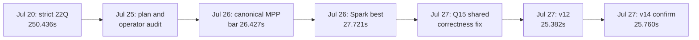

# Spark Fully-Streaming UCX TPC-H 4GPU History - 2026-07-21 to 2026-07-27

## Purpose

This page preserves the investigation history behind the Spark-visible,
fully-streaming UCX TPC-H POC. It records superseded baselines, accepted and
rejected experiments, correctness findings, and the evidence used to close the
first performance milestone.

For the current design and live status, see
[Pipelined UCX Shuffle POC Status](pipelined-shuffle-tpch-status-20260721.md).

## Milestone Timeline

| Date | State | Hot-min sum | Correctness and interpretation |
| --- | --- | ---: | --- |
| 2026-07-20 | First complete strict streaming-UCX 22Q | `250.436s` | `22/22`, zero cuDF fallback and zero MPP collapse; functional proof, but `9.2x` slower than the then-used MPP table |
| 2026-07-25 | Architecture and physical-plan audit | - | Separated Spark-visible stages from the hidden MPP native fragment graph; began operator, endpoint, and lifecycle attribution |
| 2026-07-26 | Reproduced action-matched canonical MPP, two drivers | `26.427s` | Canonical Q11 and JVM materialization; later found to be Q15-cardinality unstable |
| 2026-07-26 | Best uncontended Spark-visible run at that point | `27.721s` | `22/22`, fallback `0`, collapse `0`; first result close to the corrected MPP gate |
| 2026-07-27 | Spark v11 after Q15 GPU fix | `26.458s` | Correct `22/22`; only `31ms` above the MPP hot bar |
| 2026-07-27 | Spark v12 | `25.382s` | Correct `88/88` materializations; `1.045s` faster than MPP hot and `0.502s` faster by median |
| 2026-07-27 | Spark v13, host-contended | `31.549s` | Correct and strict, but excluded: about 175 external compiler processes raised host load to 84 |
| 2026-07-27 | Spark v14 uncontended confirmation | `25.760s` | Correct `88/88`; `0.667s` faster than MPP hot and `3ms` faster by median |

v12 and v14 used the same artifact, query overrides, expected-cardinality
map, and configuration. All 22 normalized physical-plan hashes match.
Both runs recorded `3004/3248` logical UCX writer/reader endpoints.

## Baseline Corrections

The investigation used three different historical MPP evidence sources. They
must not be mixed:

| MPP evidence | Result | Use |
| --- | ---: | --- |
| Historical min-hot table | `27.182s` | Historical target only; Q11 used `1e-4`, returned zero rows, and was not canonical SF1000 |
| Formal fast-MPP report | `25.856s` | Historical performance evidence only; it used the same non-canonical Q11 and did not rerun result correctness |
| Reproduced canonical/JVM-action run, one driver | `34.092s` | Shows that the recorded `27.182s + drivers=1` combination is not reproducible as one frozen run |
| Reproduced canonical/JVM-action run, two drivers | `26.427s` hot, `27.127s` median | Frozen performance comparison bar; later found to return Q15 rows `[0,1,0,1]` |

The original fast MPP table and the Spark-visible POC also used different
result actions. Python conversion materially inflated canonical Q11, while
the action-matched comparison used JVM `collectAsList`. Performance
comparisons after 2026-07-26 therefore require frozen SQL, result action,
artifact, fragment-driver count, query cardinality, and complete-run
provenance.

## Architecture And Plan Findings

Both paths use the Velox-cuDF operator family, but they do not use the same
execution unit:

| Dimension | Gluten-MPP | Spark fully-streaming UCX |
| --- | --- | --- |
| Outer physical plan | `VeloxColumnarToRow -> MppNativeQuery -> MppPreparedChild` | scans, exchanges, joins, aggregates, windows, and sorts remain Spark-visible |
| Runtime graph | four prestarted, long-lived native fragment replicas | 5--10 Spark stages with one Velox task and logical UCX state per task/edge |
| Shuffle width | 16, local hash width 4 | default 8, query-scoped 4 or 16 |
| Native parallelism | two drivers per fragment in the reproduced fast run | one native driver per Spark task |
| Replicated input | native fragment replica fanout | consumer-task fanout through Spark exchange edges |
| File planning | 8GiB ceiling and at least 60 splits | 16GiB ceiling and at least 4; selected fact scans capped at 8 tasks |
| Scheduling | fragment graph is already alive | task launch, stage transition, AM handshake, and per-edge queue/stream lifetime remain visible |

Important conclusions:

- A collapsed MPP outer plan is not evidence that native exchanges, scans,
  joins, or aggregates do not exist. Native fragment metrics are required.
- A Spark `Cudf*Transformer` name is not sufficient proof of strict GPU
  execution. Native validation and actual `operatorType` must also be checked.
- Velox already caches source-side outgoing UCXX endpoints by peer inside each
  executor. Two measured applications achieved `98.37%` and `98.83%` reuse.
  The remaining overhead is logical source, handshake, queue/stream state,
  task lifetime, and scheduler tail rather than one physical connection per
  Spark task.
- Increasing Spark native drivers to two or copying MPP shuffle width 16 does
  not copy the MPP fragment lifecycle.

## Correctness And Runtime Regressions Found

### Q15 duplicate floating reduction

Canonical Q15 inlined its CTE twice and independently computed two
`group by supplier_no -> sum(double)` branches. Exact equality against the
independently reduced maximum intermittently failed because GPU reduction
order changed low floating-point bits. The canonical MPP performance run
returned `[0,1,0,1]` rows, and the original Spark plan showed the same issue.

The accepted fix has two layers:

1. Gluten `ReuseGroupedAggregateForScalarMax` rewrites the narrow duplicate
   grouped-sum/scalar-max shape into one grouped aggregate followed by a
   full-partition maximum, preserving exact equality and tied maxima.
2. Velox `CudfWindow` implements the full-partition `max(field)` on GPU. The
   intermediate outer Spark plan displayed `CudfWindowExecTransformer`, but
   native validation showed that the operator was actually falling back to
   Velox CPU.

The validation harness now requires the expected result cardinality on every
warmup and timed materialization. v12 and v14 each passed all `88/88`
observations.

### UCX progress and buffer lifetime

- Old MPP used non-blocking `progressWorkerEvent(0)` continuously. A newer
  path used an indefinite `-1` wait when idle. Restoring active progress
  reduced a clean Q1/Q8/Q21 hot sum from `8.629s` to `6.385s`.
- Native intra-node broadcast cloning had a cross-stream lifetime gap. A CUDA
  event now orders the producer and clone streams before the final consumer
  can release the source.
- Receive-buffer allocator and stream-ordering differences were isolated
  behind compatibility diagnostics instead of silently changing the default
  memory-resource policy.

### Runtime and host contamination

Identical plan/config runs varied from `25.382s` to `31.549s`. v13 was
correlated with about 175 external `cc1plus`/`nvcc` processes and host load
84. Later performance runs require a multi-sample guard for external compiler
processes, host load, and GPU 4--7 occupancy. Contended runs remain useful for
correctness but are excluded from performance reproducibility.

## Accepted Changes

- Native UCX active progress and endpoint-cache diagnostics.
- Cross-stream fencing for asynchronous receive and intra-node broadcast
  clone lifetimes.
- Raw-key native partitioning and bounded producer/executor admission.
- Query-scoped scan widths and task caps where full-run evidence showed a
  benefit.
- Native-runtime GPU admission for shapes that expose multiple independent
  Velox tasks per GPU.
- Q15 duplicate grouped-aggregate reuse plus native cuDF full-partition max.
- Per-materialization result-cardinality gates, strict fallback gates, and
  MPP/BSP-collapse guards in the run summarizer.

## Rejected Or Neutral Experiments

These results are retained to prevent repeated dead ends:

| Experiment | Result | Decision |
| --- | --- | --- |
| Spark exchange reuse for native streaming broadcast | Same Q11 plan, zero `ReusedExchange`, same `208/208` logical endpoints | Not valid because UCX destination queues are destructive and cannot replay one sequence to multiple consumers |
| Driver broadcast instead of native streaming broadcast | Q11 regressed to `2.364s`; Q10 regressed to `1.638s` | Rejected |
| Replicated hash cache at `CudfHashJoin` build | Q8/Q10/Q21 hot sum regressed `9.8%` | Too late to remove consumer UCX tasks and streams; rejected |
| Global GPU lock | Stabilized Q1 but full 22Q regressed from `27.721s` to `28.095s` | Rejected globally; use scoped admission |
| Two native drivers per Spark task | Did not reproduce MPP fragment parallelism and generally regressed | Rejected as default |
| Shuffle width 16 for Q10 | `1.631s` hot versus `1.511s` at width 4 | Rejected for Q10 |
| Scan cap 4 for Q10 | `1.832s` hot and `2.2905s` median | Rejected |
| Partial-groupby bypass and executor caps 2/4 | No repeatable Q10 win | Neutral/rejected |

## Remaining Per-Query Architecture Gaps

The aggregate first milestone is closed, but the stricter criterion of no
material per-query regression remains.

Q10 is the clearest residual case. Its Spark plan has six exchange boundaries,
seven pipeline groups, three hash joins, and four scans. In clean
10-iteration tests, the best configuration was shuffle 8 and executor cap 3
at `1.456s` hot versus MPP `1.350s`; no configuration removed its median tail.
Native scan, join, exchange, and aggregate timing remained broadly stable
while several Spark stages lengthened together. This is attributed to
Spark-visible stage/edge/task lifecycle rather than a Velox-cuDF kernel
regression.

Q21 exposes an additional planner difference. MPP removes four local sorts,
pushes a replicated join into the hash-exchange producer, inserts a partial
TopN, and raises one final-aggregate fragment from two to four drivers. The
Spark path retains eight stages and seven native UCX edges. These fragment
planner optimizations cannot be reproduced by changing one cuDF operator or
Spark shuffle partition setting.

## Reproducibility Gate

An accepted full result must satisfy all of the following:

- Complete `22/22`.
- Expected cardinality for every warmup and timed materialization.
- Zero native cuDF fallback.
- Zero MPP or BSP plan-collapse evidence.
- Native UCX shuffle replacement evidence.
- Zero fetch/file errors.
- Frozen artifact checksums, SQL bundle, result action, and query overrides.
- Uncontended GPU and host preflight for performance classification.
- Per-query plan fingerprints compared after normalizing generated attribute,
  scalar-subquery, and plan identifiers.

## Frozen Source Commits

- Spark: [`837370794ee`](https://github.com/winningsix/spark/commit/837370794ee4910fddc02676c0b7f9c7efef52f9)
  on `poc/tpch4gpu-spark5-20260717`.
- Gluten: [`90301a721`](https://github.com/winningsix/gluten/commit/90301a721578f948d3ec7ce70d0239639f749c94)
  on `poc/tpch4gpu-gluten-cleanup-perf-20260724`.
- Velox: [`14129cfd7`](https://github.com/winningsix/velox-1/commit/14129cfd7bcfd7a83ea3f7ced2b469cb40c585df)
  on `poc/tpch4gpu-velox-20260717`.
