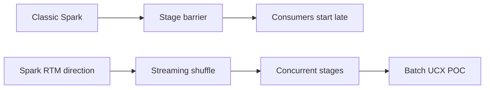
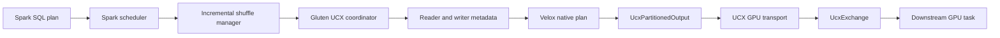
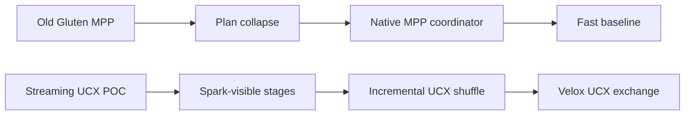
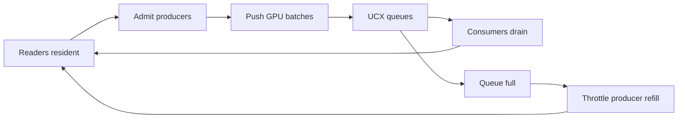
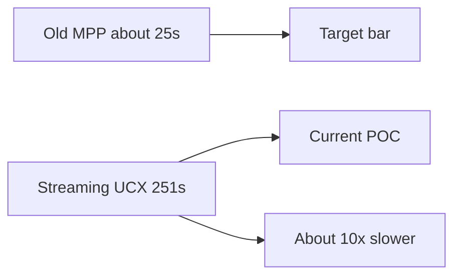

# Spark 4.2 Pipelined UCX Shuffle POC Status - 2026-07-21

## Scope

This document summarizes the current Spark 4.2 / Gluten / Velox POC for fully streaming UCX shuffle on TPC-H 1TB with 4 GPUs.

The public upstream material describes this direction as Spark 4.2 Real-Time Mode (RTM) and related Spark 4.x work. Some local branch and path names still include `spark5` because of the original POC naming, but the design motivation and upstream reference point should be read as Spark 4.2 / Spark 4.x RTM.

The diagrams are intentionally simple so they render cleanly in GitHub Wiki.

## Code Branches

| Component | Branch |
| --- | --- |
| Spark | `poc/tpch4gpu-spark5-20260717` |
| Gluten | `poc/tpch4gpu-gluten-20260717` |
| Velox | `poc/tpch4gpu-velox-20260717` |

## Motivation

The old Gluten MPP path is very fast, but it relies on collapsing Spark query fragments into native MPP execution. That gives most query control to the native MPP layer instead of Spark's normal shuffle, stage, task, retry, and resource model. It is the current performance target, but it is not an incremental Spark shuffle manager.

The target of this POC is different:

- Keep Spark stages and shuffle dependencies visible to Spark.
- Push shuffle data to downstream tasks as soon as batches are ready.
- Run producer and consumer stages concurrently.
- Use Velox UCX exchange as the native GPU data plane.
- Avoid MPP plan collapse.
- Avoid CPU fallback.
- Add enough query/group-level control to avoid deadlock, memory blow-up, and unnecessary spill.

## Upstream Spark Changes

Relevant upstream references:

- Databricks Spark 4.2 blog: https://www.databricks.com/blog/introducing-apache-spark-42
- Apache JIRA SPARK-54699: https://issues.apache.org/jira/browse/SPARK-54699
- Apache Spark 4.1 release notes: https://spark.apache.org/releases/spark-release-4.1.0.html
- Databricks RTM introduction: https://www.databricks.com/blog/introducing-real-time-mode-apache-sparktm-structured-streaming

The important upstream points for this POC are:

- Streaming shuffle is push-based: upstream tasks can send output directly to downstream tasks.
- Concurrent stage scheduling is required: dependent stages must be allowed to run at the same time.
- Upstream RTM starts from Structured Streaming. It does not directly provide a batch SQL MPP query coordinator.

## Spark 4.2 POC Changes

The Spark-side POC changes turn the RTM direction into a batch SQL incremental shuffle path:

- Add pipelined shuffle dependency metadata for supported columnar exchanges.
- Route pipelined shuffles through `UcxColumnarShuffleManager`.
- Keep normal shuffles on the existing columnar shuffle manager.
- Allow concurrent pipelined task sets in `TaskSchedulerImpl`.
- Track live task sets so resident readers remain visible even when they have no pending tasks.
- Gate producer refill on downstream reader residency.
- Add scheduler tests for the updated `TaskSchedulerImpl` behavior.

These changes need to live in Spark because they affect stage admission, task-set liveness, resource fairness, and shuffle manager routing. Gluten and Velox cannot fully solve those from below Spark.

## Current Architecture

The native UCX template no longer uses the old Gluten MPP plan-collapse workaround. Spark keeps the stage graph visible, Gluten owns UCX metadata/control, and Velox owns native GPU data movement.

Current path:

1. Spark physical planning marks supported columnar shuffle dependencies as pipelined.
2. `PipelinedShuffleManagerRouter` sends pipelined shuffles to `UcxColumnarShuffleManager`.
3. Gluten creates UCX shuffle handles and registers writer/reader endpoints.
4. `NativeUcxShuffleReadMetadataIterator` exposes reader metadata.
5. `VeloxIteratorApi` passes UCX reader specs and writer context into Velox task construction.
6. `SubstraitToVeloxPlan` creates Velox UCX `ExchangeNode`s.
7. `VeloxRuntime` wraps writer tasks with native UCX `PartitionedOutput`.
8. Velox cuDF adapters replace these with `UcxExchange` and `UcxPartitionedOutput`.

Representative evidence from the latest Q7 validation:

- `spark.gluten.mpp.enabled=false`
- `spark.sql.shuffle.pipelined.enabled=true`
- `spark.shuffle.manager.incremental=org.apache.spark.shuffle.UcxColumnarShuffleManager`
- `dataPlane=velox-native-ucx-exchange`
- `Created Velox UCX ExchangeNode`
- `replacing Exchange with UcxExchange`
- `Wrapped Velox plan with native UCX PartitionedOutput`
- `replacing PartitionedOutput with UcxPartitionedOutput`

## Difference From Old Gluten MPP

| Area | Old Gluten MPP | Streaming UCX POC |
| --- | --- | --- |
| Spark stage visibility | Mostly hidden behind native MPP | Preserved |
| Shuffle model | Native MPP exchange | Spark incremental shuffle manager |
| Data plane | Native Velox/MPP | Velox UCX exchange |
| Query coordinator | Native MPP coordinator | Spark/Gluten driver-side coordinator needed |
| Performance today | Fast baseline | Functional but slow |
| Main value | Maximum fused native execution | Spark-compatible streaming shuffle design |

## Fit With Streaming MPP

What already matches the streaming MPP design:

- Push-based UCX shuffle data path.
- Concurrent producer and consumer stages.
- All-stage-up style reader residency checks.
- Spark-visible shuffle dependency.
- Driver-side group control in Spark/Gluten.
- Velox-native `UcxExchange` and `UcxPartitionedOutput`.
- No `MppNativeQueryExec` path in the native UCX template.

Main gaps:

- Production query/group coordinator is still missing.
- Backpressure needs a stronger cross-layer credit model.
- Failure, retry, endpoint cleanup, and abort semantics are still POC-level.
- Runtime bloom currently has a fully-GPU gap.
- Velox native operator timing is still insufficient for deep performance attribution.
- Performance is not close to the old 4GPU Gluten MPP baseline yet.

## Control Plane And Backpressure

There are three layers of control:

| Layer | Responsibility |
| --- | --- |
| Spark driver scheduler | Pipelined groups, concurrent stages, task-set liveness, reader residency, producer refill |
| Gluten UCX coordinator | Shuffle/group state, endpoint registration, readiness, completion, abort |
| Velox UCX exchange | Native queues, GPU buffers, local operator blocking and data movement |

Velox can block local operators when UCX queues are full. That is necessary but not sufficient. Spark/Gluten still need global state: which stages are admitted, which readers are resident, whether producers may refill, whether a group should abort, and how retry/cleanup should happen.

The latest Spark scheduler fix keeps live task sets in a pipelined group registry instead of relying only on `Pool.getSortedTaskSetQueue`. This matters because a downstream reader task set can have zero pending tasks while its already-launched tasks are still resident. Without the live registry, Spark can lose visibility of live readers and block producer refill with `waiting-for-reader-residency`.

## Current Validation

Latest focused validation after the live task-set registry fix:

| Run | GPUs | Runtime bloom | Time | Functional | Strict GPU | MPP evidence | Velox UCX evidence |
| --- | --- | --- | ---: | --- | --- | ---: | --- |
| Q7 | `0,1,6,7` | enabled | `17.227s` | pass | no, `122` cuDF fallbacks | `0` | `29` exchanges, `253` outputs |
| Q7 | `0,1,3,4` | disabled | `32.801s` | pass | pass, `0` cuDF fallbacks | `0` | `28` exchanges, `252` outputs |

Run roots:

- Bloom enabled Q7: `/raid/ferdinandx/gtc/poc/spark5-pipelined-tpch4gpu-20260717/tpch-4gpu-gpu03/runs/native-velox-plan-q7-4gpu0167-livegroup-20260721-094942`
- Bloom disabled Q7: `/raid/ferdinandx/gtc/poc/spark5-pipelined-tpch4gpu-20260717/tpch-4gpu-gpu03/runs/native-velox-q7-4gpu0134-querybloomoff-20260721-095737`

Spark scheduler unit validation:

- `org.apache.spark.scheduler.TaskSchedulerImplSuite`
- Result: `123` tests passed

## Historical 22-Query Streaming UCX Result

The best completed 22-query 4GPU strict run from the current streaming UCX POC profile is:

- Run root: `/raid/ferdinandx/gtc/poc/spark5-pipelined-tpch4gpu-20260717/runs/full22-queryconf-q14-cap12-20260720-0640`
- Complete: true
- Functional complete: true
- Strict cuDF complete: true
- Sum of query times: `250.436s`
- Power test time: `251.000s`
- Total wall time including table setup: `263.295s`
- MPP evidence: `0`
- cuDF fallback: `0`
- UCX writer endpoints: `3156`
- UCX reader endpoints: `8161`
- Native UCX shuffle handles: `3437`

Important caveat: this 22-query run was before the latest Spark live task-set registry fix. The latest code has not yet been rerun for a full 22/22 pass.

## Previous Gluten MPP 4GPU Baseline

The previous fast 4GPU result was from the old Spark 3.5 + Gluten MPP collapsed/native execution path:

- Run root: `/raid/ferdinandx/q2/runs/perf-4gpu-20260603/single-session-agent2-q17fix-full22-20260612-093223`
- Spark: `spark-3.5.5-bin-hadoop3`
- `spark.gluten.mpp.enabled=true`
- 4 executors, 1 GPU per task, `spark.task.resource.gpu.amount=1`
- `spark.sql.shuffle.partitions=16`
- Runtime bloom enabled
- `mpp.maxDriversPerFragment=1`
- `cudf.concurrentGpuTasks=2`
- Power test time: about `25s`
- Raw `time.csv` in the cited run reports `23.000s`
- Total time including table setup: `33.725s`

The user-facing shorthand for this baseline should be "about 25 sec". The raw cited run is slightly faster at `23.000s`, but the architecture/performance comparison should not imply that `23.000s` is the stable baseline for every run.

This baseline is not apples-to-apples with the streaming UCX POC. It used old Gluten MPP execution, which fused native query fragments and bypassed much of Spark's normal stage-by-stage execution overhead. It remains the target performance bar, but it is not an incremental Spark shuffle manager.

## Performance Comparison

At 22-query level:

| Metric | Streaming UCX POC | Old Gluten MPP baseline | Gap |
| --- | ---: | ---: | ---: |
| Power test time | `251.000s` | about `25s`, raw cited run `23.000s` | about `10x` slower |
| Sum of query times | `250.436s` | `4.685s` query-only sum | `53.5x` slower query-only |
| Total wall time | `263.295s` | `33.725s` | `7.8x` slower |
| cuDF fallback | `0` in strict 22/22 run | `0` observed by guard | comparable |
| MPP plan-collapse evidence | `0` | MPP enabled / collapsed path | intentionally different |

Per-query comparison:

| Query | Streaming UCX POC s | Old Gluten MPP s | Gap |
| --- | ---: | ---: | ---: |
| Q1 | 5.512 | 0.450 | 12.2x |
| Q2 | 6.583 | 1.236 | 5.3x |
| Q3 | 14.404 | 0.165 | 87.3x |
| Q4 | 2.852 | 0.152 | 18.8x |
| Q5 | 31.957 | 0.197 | 162.2x |
| Q6 | 0.852 | 0.121 | 7.0x |
| Q7 | 19.572 | 0.185 | 105.8x |
| Q8 | 13.300 | 0.236 | 56.4x |
| Q9 | 12.540 | 0.182 | 68.9x |
| Q10 | 19.502 | 0.157 | 124.2x |
| Q11 | 4.763 | 0.167 | 28.5x |
| Q12 | 15.425 | 0.115 | 134.1x |
| Q13 | 4.625 | 0.093 | 49.7x |
| Q14 | 2.892 | 0.112 | 25.8x |
| Q15 | 6.210 | 0.158 | 39.3x |
| Q16 | 5.310 | 0.100 | 53.1x |
| Q17 | 18.440 | 0.137 | 134.6x |
| Q18 | 28.332 | 0.145 | 195.4x |
| Q19 | 2.819 | 0.105 | 26.8x |
| Q20 | 6.067 | 0.167 | 36.3x |
| Q21 | 25.667 | 0.176 | 145.8x |
| Q22 | 2.812 | 0.129 | 21.8x |

The per-query MPP numbers are extremely small because that run used the old collapsed/native MPP profile and different execution semantics. The comparison should be used as a performance bar, not as proof that the Spark-level streaming path should already have identical overhead.

## Performance Interpretation

The current POC has passed the important functional checks: 22/22 queries completed in a strict fully-GPU streaming UCX run, MPP evidence was zero, cuDF fallback was zero, and Velox native UCX exchange/partitioned output evidence was present.

The performance is still far from acceptable. The largest likely contributors are:

- Spark task/stage overhead is visible again because the query is no longer hidden by MPP plan collapse.
- The current control plane is conservative and can underfill GPUs.
- Endpoint/control metadata overhead is high: thousands of writer endpoints, reader endpoints, and shuffle handles.
- Runtime bloom has a speed/correctness trade-off today: bloom enabled is faster on Q7 but not strict fully GPU; bloom disabled is strict fully GPU but slower.
- We need Velox native plan operator timing, not `MppNativeQuery` timing, to split shuffle wait, compute time, queue blocking, endpoint setup, and scheduler gaps.

## Next Work

Next engineering targets:

1. Finish the driver-side pipelined query/group coordinator state machine.
2. Tighten Spark/Gluten/Velox backpressure with a real credit signal.
3. Add Velox native operator timing for `UcxExchange`, `UcxPartitionedOutput`, GPU compute, blocked time, queue wait, endpoint wait, and spill/fallback counters.
4. Fix or replace the runtime bloom path so it remains fully GPU.
5. Reduce endpoint setup and polling overhead.
6. Rerun full 22/22 after the next coordinator/backpressure iteration.
