# Spark 5 Pipelined UCX Shuffle POC Status - 2026-07-21

## Scope

This document summarizes the current Spark 5 / Gluten / Velox POC for fully streaming UCX shuffle on TPC-H 1TB with 4 GPUs.

The public upstream material currently describes this work as Spark 4.x Real-Time Mode (RTM). In this POC we are working on a Spark 5.x / Spark 5.2 branch that follows the same design direction: Spark-level concurrent stages plus a streaming shuffle path, with Gluten and Velox providing a GPU-native UCX data plane for batch SQL.

Wiki note: the diagrams below use Mermaid code blocks, which render directly in GitHub Markdown and GitHub Wiki. If the final wiki target does not support Mermaid, these blocks can be exported to images without changing the surrounding text.

## Code Branches

- Spark: `poc/tpch4gpu-spark5-20260717`
- Gluten: `poc/tpch4gpu-gluten-20260717`
- Velox: `poc/tpch4gpu-velox-20260717`

## Motivation

The old Gluten MPP path is very fast, but it achieves that by collapsing Spark query fragments into native MPP execution. That makes the query mostly controlled by Gluten/Velox native coordination instead of Spark's normal shuffle, stage, task, retry, and resource model. It is a good performance baseline, but it is not an incremental Spark shuffle manager.

The target here is different:

- Keep Spark stages and shuffle dependencies visible to Spark.
- Let upstream tasks push shuffle data to downstream tasks as data becomes available instead of waiting for the full upstream stage to finish.
- Schedule multiple dependent stages concurrently so the pipeline can stay resident.
- Use Velox UCX exchange as the native GPU data plane.
- Avoid MPP plan collapse and avoid CPU fallback.
- Build enough query/group-level control to prevent deadlock, memory blow-up, and unnecessary spill.

This is motivated by the same upstream Spark RTM direction. Spark 4.1 introduced the first official RTM support for stateless Structured Streaming. Spark 4.2 extended RTM coverage, and the next stateful RTM work is tracked under SPARK-54699 with three key pieces: streaming shuffle, concurrent stage scheduling, and stateful operator support.

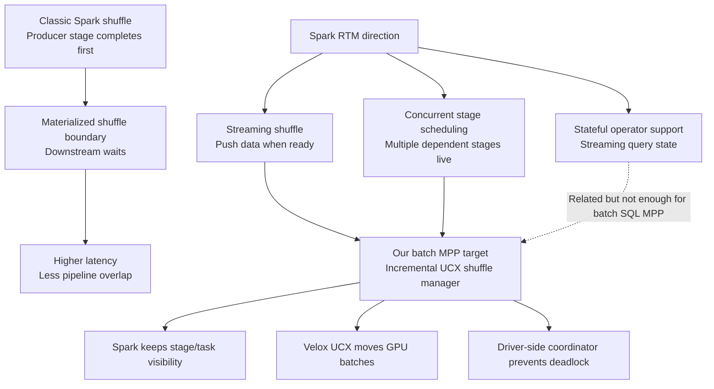

## Upstream References

- Databricks Spark 4.2 blog: https://www.databricks.com/blog/introducing-apache-spark-42
- Apache JIRA SPARK-54699: https://issues.apache.org/jira/browse/SPARK-54699
- Apache Spark 4.1 release notes: https://spark.apache.org/releases/spark-release-4.1.0.html
- Databricks RTM introduction: https://www.databricks.com/blog/introducing-real-time-mode-apache-sparktm-structured-streaming

The important upstream points for this POC are:

- Streaming shuffle is push-based: upstream tasks can send output directly to downstream-stage tasks in a pipelined fashion.
- Concurrent stage scheduling is required: downstream stages must be allowed to run before upstream stages complete.
- RTM's initial upstream target is Structured Streaming, but the scheduler and shuffle mechanics are directly relevant to batch MPP-style pipelining.

## Spark 5.2 POC Changes

The Spark-side POC changes are the pieces that turn upstream RTM ideas into a batch SQL incremental shuffle path:

- Pipelined shuffle dependency metadata so supported columnar exchanges can opt into incremental UCX shuffle.
- `PipelinedShuffleManagerRouter` so normal shuffles still use the regular columnar shuffle manager while pipelined shuffles use `UcxColumnarShuffleManager`.
- Concurrent pipelined task-set scheduling so producer and consumer stages in the same group can run at the same time.
- Reader-residency tracking through a live task-set registry, because a consumer task set may have no pending tasks while its already-launched reader tasks are still the important live resources.
- Group-level admission/refill checks so producers are not refilled before enough downstream readers are resident.
- Scheduler tests covering the updated `TaskSchedulerImpl` behavior.

These changes are Spark changes because they affect stage admission, task-set liveness, resource fairness, and shuffle manager routing. Gluten and Velox cannot fully solve those from below Spark because they do not own the Spark driver scheduler state.

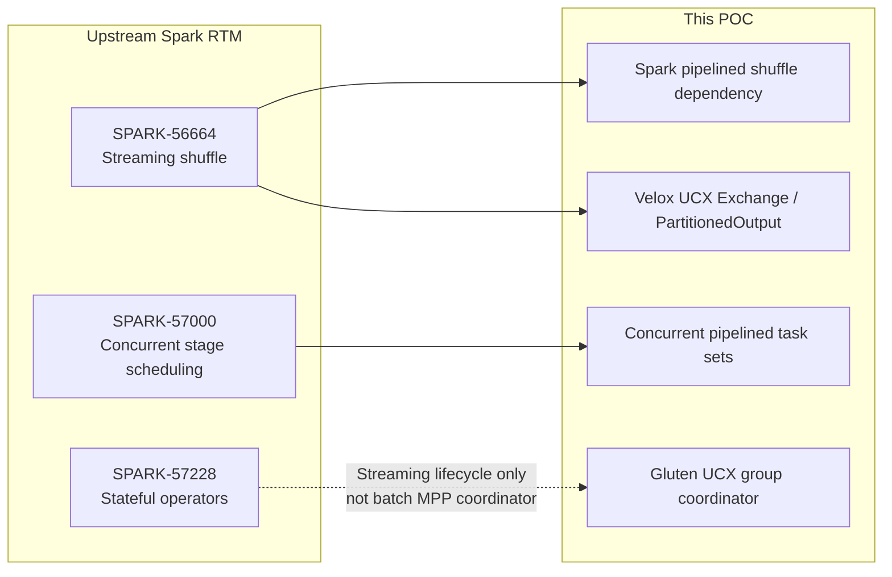

## Fit With Streaming MPP

The current POC aligns with the streaming MPP design in these areas:

- Push-based shuffle data plane: Velox `UcxPartitionedOutput` pushes produced batches to downstream UCX endpoints, and Velox `UcxExchange` reads them as a native exchange source.
- Concurrent stage scheduling: Spark scheduler changes allow task sets from multiple pipelined stages to be live at the same time.
- All-stage-up style admission: downstream readers must be resident before producer refill proceeds, otherwise a push-based pipeline can deadlock or over-buffer.
- Spark-visible shuffle dependency: the shuffle remains a Spark dependency instead of being hidden behind MPP plan collapse.
- Driver-side control: Spark/Gluten coordinate shuffle groups, writer endpoint registration, reader readiness, completion, and abort.
- Velox-native operator path: the physical data movement is implemented by Velox native UCX exchange and partitioned output operators, not by the old `MppNativeQueryExec` workaround.

The main remaining gaps are:

- Upstream Spark RTM does not provide a batch SQL MPP query coordinator for this use case. Structured Streaming RTM has its own query lifecycle; our TPC-H batch path still needs a Spark/Gluten driver-side `PipelinedQueryCoordinator` or equivalent.
- Velox operator state alone is not enough to control the whole query. Velox sees task-local operator state, but it does not own Spark stage admission, task-set liveness, retry, executor placement, or cross-stage reader residency.
- Backpressure must cross layers. Velox UCX queues can block the native data path, but Spark still needs scheduler-level admission/refill control so it does not launch producers without enough live consumers or let one stage monopolize GPU residency.
- Failure semantics are still POC-level. Group abort, retry, endpoint cleanup, duplicate writer registration, and partial reader failure need production-grade handling.
- Full GPU coverage still has a runtime bloom gap. Runtime bloom improves Q7 latency but currently causes Velox cuDF fallback around `velox_might_contain` / `velox_bloom_filter_agg`.
- Performance is not yet close to the old Gluten MPP baseline. The current path proves the architectural direction, but not the final performance envelope.

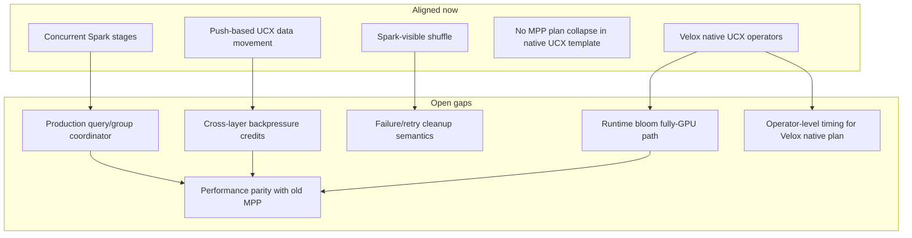

## Current Architecture

The shuffle path is no longer the old Gluten MPP plan-collapse workaround when running the native UCX template. The current path is:

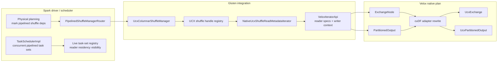

Compared with the old MPP path:

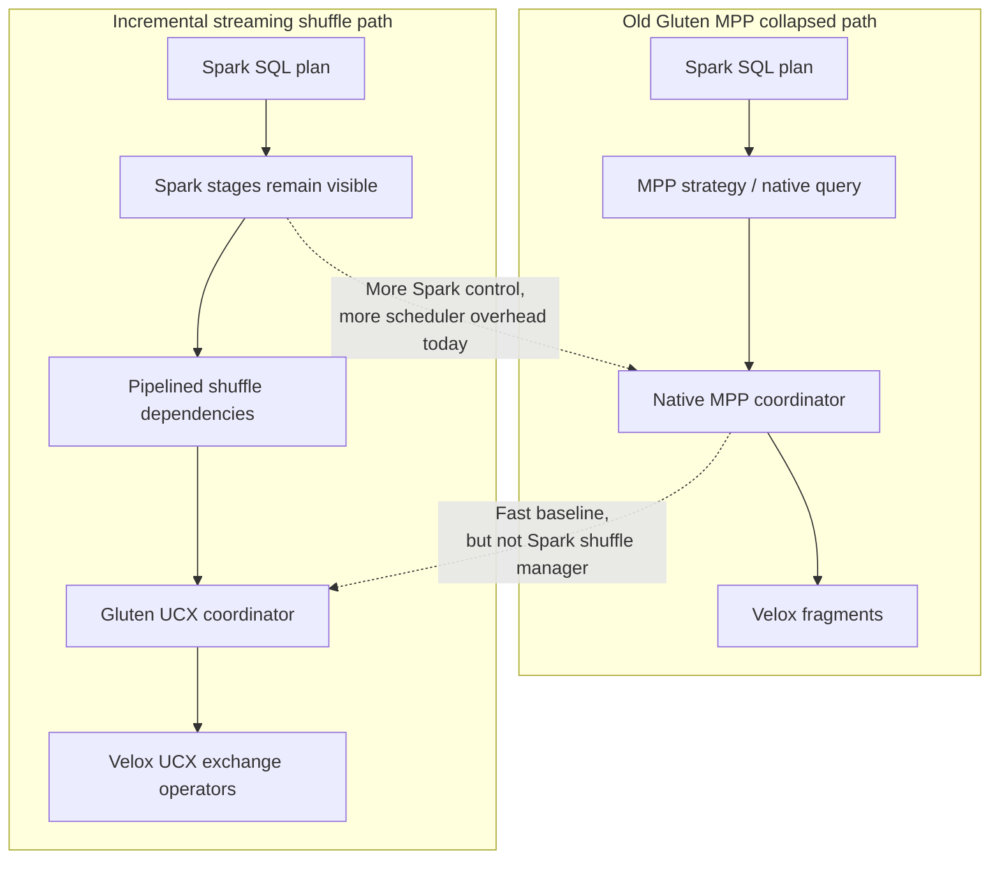

1. Spark physical planning marks supported columnar shuffle dependencies as pipelined.
2. `PipelinedShuffleManagerRouter` delegates regular shuffles to the standard columnar shuffle manager and pipelined shuffles to `UcxColumnarShuffleManager`.
3. Gluten creates UCX shuffle handles, registers writer endpoints, and exposes reader metadata through `NativeUcxShuffleReadMetadataIterator`.
4. `VeloxIteratorApi` captures native UCX reader specs and writer context while building Velox tasks.
5. `SubstraitToVeloxPlan` creates Velox UCX `ExchangeNode`s for native shuffle inputs.
6. `VeloxRuntime` wraps shuffle writer tasks with native UCX `PartitionedOutput`.
7. Velox cuDF operator adapters replace those nodes with `UcxExchange` and `UcxPartitionedOutput`.

Representative evidence from the latest Q7 validation:

- `spark.gluten.mpp.enabled=false`
- `spark.sql.shuffle.pipelined.enabled=true`
- `spark.shuffle.manager.incremental=org.apache.spark.shuffle.UcxColumnarShuffleManager`
- `dataPlane=velox-native-ucx-exchange`
- `Created Velox UCX ExchangeNode`
- `replacing Exchange with UcxExchange`
- `Wrapped Velox plan with native UCX PartitionedOutput`
- `replacing PartitionedOutput with UcxPartitionedOutput`

## Control Plane And Backpressure

There are three layers of control:

- Spark driver scheduler control: pipelined shuffle groups, concurrent stage scheduling, group admission, deferred consumer completion, reader residency checks, per-stage/per-executor caps, and producer fairness.
- Gluten UCX coordinator: shuffle/group state, writer endpoint registration, reader coverage, reader readiness gates, reader endpoint polling, and group completion/abort messages.
- Velox UCX exchange: native UCX exchange and partitioned output operators with UCX output queues and backpressure on the device-buffer data path.

The most recent Spark scheduler fix keeps live task sets in a pipelined group registry instead of relying only on `Pool.getSortedTaskSetQueue`. That matters because a downstream reader task set can have zero pending tasks while its tasks are still running and resident. Without the live registry, Spark could lose visibility of resident readers and block producer refill indefinitely with `waiting-for-reader-residency`.

The design implication is that query-level control still belongs above Velox. Velox should enforce local operator and buffer backpressure, while Spark/Gluten must own global group state: which stages are admitted, which readers are resident, whether producers may refill, whether a group should abort, and how retry/cleanup is handled.

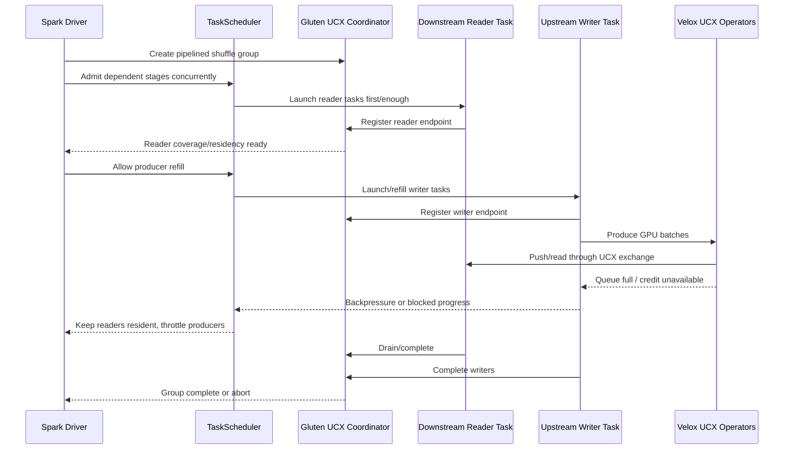

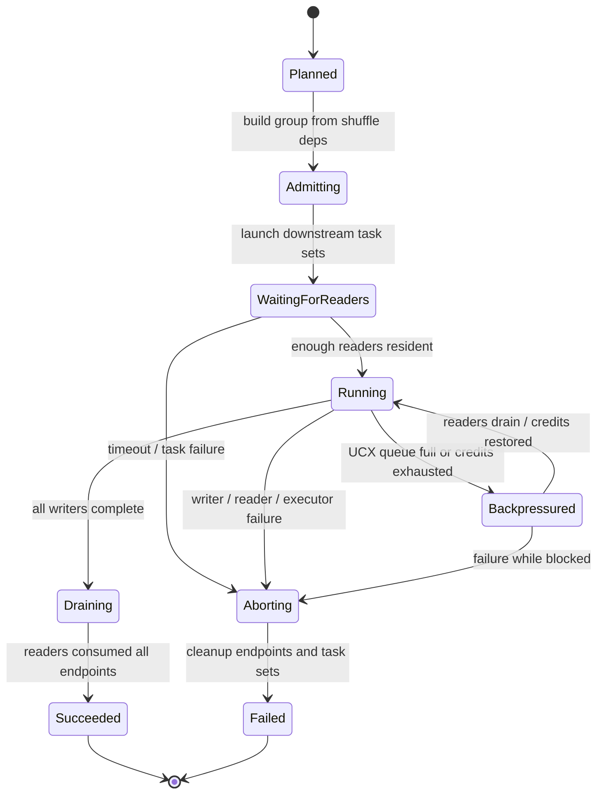

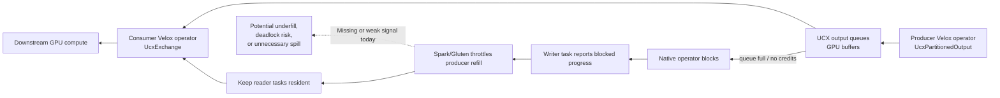

## Current Validation

Latest focused validation after the live task-set registry fix:

- Q7 on GPUs `0,1,6,7`, runtime bloom enabled:
  - Run root: `/raid/ferdinandx/gtc/poc/spark5-pipelined-tpch4gpu-20260717/tpch-4gpu-gpu03/runs/native-velox-plan-q7-4gpu0167-livegroup-20260721-094942`
  - Time: `17.227s`
  - Functional: pass
  - MPP evidence: `0`
  - Velox native UCX exchange nodes: `29`
  - Velox native UCX partitioned outputs: `253`
  - cuDF fallback: `122`

- Q7 on GPUs `0,1,3,4`, runtime bloom disabled:
  - Run root: `/raid/ferdinandx/gtc/poc/spark5-pipelined-tpch4gpu-20260717/tpch-4gpu-gpu03/runs/native-velox-q7-4gpu0134-querybloomoff-20260721-095737`
  - Time: `32.801s`
  - Functional: pass
  - Strict fully GPU: pass, `cudf_fallbacks=0`
  - MPP evidence: `0`
  - Velox native UCX exchange nodes: `28`
  - Velox native UCX partitioned outputs: `252`

Spark scheduler unit validation:

- `org.apache.spark.scheduler.TaskSchedulerImplSuite`
- Result: `123` tests passed

## Historical 22-Query Streaming UCX Result

The best completed 22-query 4GPU strict run from the current streaming UCX POC profile is:

- Run root: `/raid/ferdinandx/gtc/poc/spark5-pipelined-tpch4gpu-20260717/runs/full22-queryconf-q14-cap12-20260720-0640`
- Complete: true
- Functional complete: true
- Strict cuDF complete: true
- Sum of query times: `250.436s`
- Power test time: `251.000s`
- Total wall time including table setup: `263.295s`
- MPP evidence: `0`
- cuDF fallback: `0`
- UCX writer endpoints: `3156`
- UCX reader endpoints: `8161`
- Native UCX shuffle handles: `3437`

Important caveat: this 22-query run was before the latest Spark live task-set registry fix. The latest code has not yet been rerun for a full 22/22 pass.

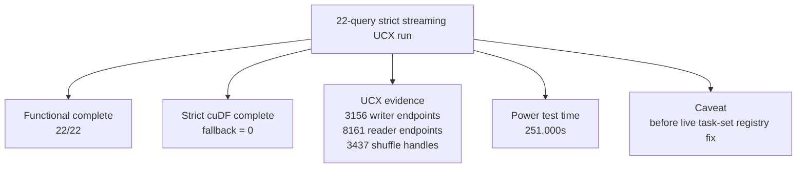

## Previous Gluten MPP 4GPU Baseline

The previous fast 4GPU result was from the old Spark 3.5 + Gluten MPP collapsed/native execution path:

- Run root: `/raid/ferdinandx/q2/runs/perf-4gpu-20260603/single-session-agent2-q17fix-full22-20260612-093223`
- Spark: `spark-3.5.5-bin-hadoop3`
- `spark.gluten.mpp.enabled=true`
- 4 executors, 1 GPU per task, `spark.task.resource.gpu.amount=1`
- `spark.sql.shuffle.partitions=16`
- Runtime bloom enabled
- `mpp.maxDriversPerFragment=1`
- `cudf.concurrentGpuTasks=2`
- Power test time: `23.000s`
- Total time including table setup: `33.725s`

The user-facing shorthand for this baseline has been "about 23-25 sec". The raw `time.csv` reports `23.000s` Power Test Time.

This baseline is not apples-to-apples with the streaming UCX POC. It used the old Gluten MPP execution model, which fuses native query fragments and bypasses much of Spark's normal stage-by-stage execution overhead. It remains the target performance bar, but it is not an incremental Spark shuffle manager.

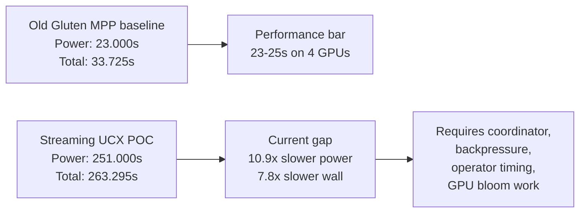

## Performance Comparison

At 22-query level:

| Metric | Streaming UCX POC | Old Gluten MPP baseline | Gap |
| --- | ---: | ---: | ---: |
| Power test time | `251.000s` | `23.000s` | `10.9x` slower |
| Sum of query times | `250.436s` | `4.685s` query-only sum | `53.5x` slower query-only |
| Total wall time | `263.295s` | `33.725s` | `7.8x` slower |
| cuDF fallback | `0` in strict 22/22 run | `0` observed by guard | comparable |
| MPP plan-collapse evidence | `0` | MPP enabled / collapsed path | intentionally different |

Per-query comparison:

| Query | Streaming UCX POC s | Old Gluten MPP s | Gap |
| --- | ---: | ---: | ---: |
| Q1 | 5.512 | 0.450 | 12.2x |
| Q2 | 6.583 | 1.236 | 5.3x |
| Q3 | 14.404 | 0.165 | 87.3x |
| Q4 | 2.852 | 0.152 | 18.8x |
| Q5 | 31.957 | 0.197 | 162.2x |
| Q6 | 0.852 | 0.121 | 7.0x |
| Q7 | 19.572 | 0.185 | 105.8x |
| Q8 | 13.300 | 0.236 | 56.4x |
| Q9 | 12.540 | 0.182 | 68.9x |
| Q10 | 19.502 | 0.157 | 124.2x |
| Q11 | 4.763 | 0.167 | 28.5x |
| Q12 | 15.425 | 0.115 | 134.1x |
| Q13 | 4.625 | 0.093 | 49.7x |
| Q14 | 2.892 | 0.112 | 25.8x |
| Q15 | 6.210 | 0.158 | 39.3x |
| Q16 | 5.310 | 0.100 | 53.1x |
| Q17 | 18.440 | 0.137 | 134.6x |
| Q18 | 28.332 | 0.145 | 195.4x |
| Q19 | 2.819 | 0.105 | 26.8x |
| Q20 | 6.067 | 0.167 | 36.3x |
| Q21 | 25.667 | 0.176 | 145.8x |
| Q22 | 2.812 | 0.129 | 21.8x |

The per-query MPP numbers are extremely small because that run is the old collapsed/native MPP profile and includes different execution semantics. The comparison should be used as a performance bar, not as proof that the current Spark-level streaming path should have identical per-query overheads without further scheduler/control-plane optimization.

The chart below compresses the 22-query comparison into four buckets. The old MPP path is almost flat at this scale because each query reported sub-second latency except Q2.

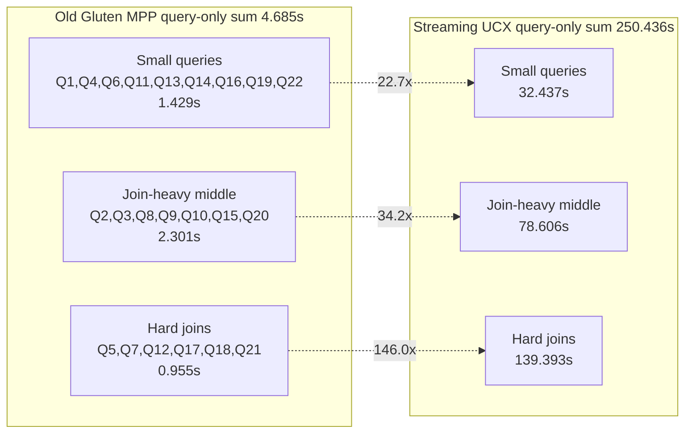

## Performance Interpretation

The current POC has passed the important functional checks: 22/22 queries completed in a strict fully-GPU streaming UCX run, MPP evidence was zero, cuDF fallback was zero, and Velox native UCX exchange/partitioned output evidence was present.

The performance is still far from acceptable. The largest likely contributors are:

- Spark-level task/stage overhead is now visible again because we are no longer using query-level MPP collapse.
- The current control plane is conservative. Reader residency waits and group admission avoid deadlock, but can underfill GPUs or serialize producer refill.
- Endpoint/control metadata is high: the 22-query run registered thousands of writer/reader endpoints and shuffle handles.
- Runtime bloom has a speed/correctness trade-off today: bloom enabled is faster on Q7 but not strict fully GPU; bloom disabled is strict fully GPU but slower.
- We need Velox native plan operator timing, not `MppNativeQuery` timing, to separate shuffle wait, operator compute, output queue blocking, endpoint setup, and scheduler gaps.

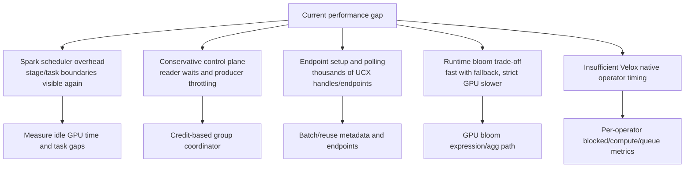

## Next Work

The next engineering targets are:

1. Finish the driver-side pipelined query/group coordinator state machine: group admission, all-stage-up gating, reader residency, producer refill credits, completion, abort, and retry cleanup.
2. Tighten backpressure across Spark and Velox: expose enough native queue/readiness state to Spark/Gluten so scheduler decisions are based on actual consumer capacity.
3. Add operator-level timing for Velox native plans: `UcxExchange`, `UcxPartitionedOutput`, GPU operators, blocked time, queue wait, endpoint wait, and spill/fallback counters.
4. Fix the runtime bloom GPU path or replace it with a GPU-compatible pruning path.
5. Reduce endpoint setup/control-plane overhead through batching, reuse, and less polling.
6. Rerun full 22/22 after the live task-set registry fix and after the next coordinator/backpressure iteration.

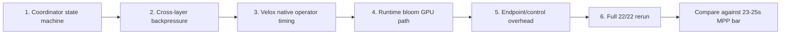
