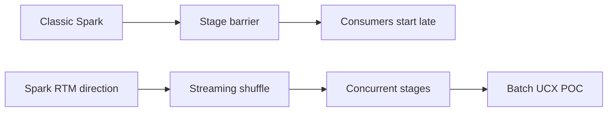
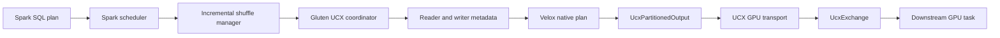
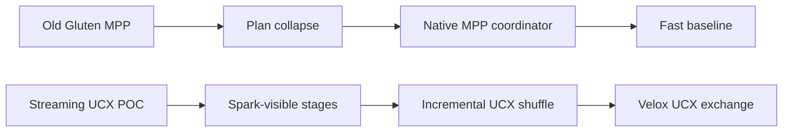
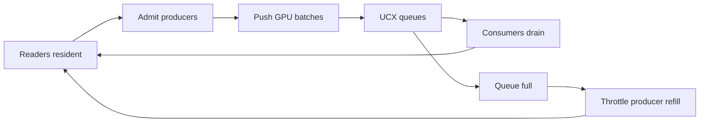
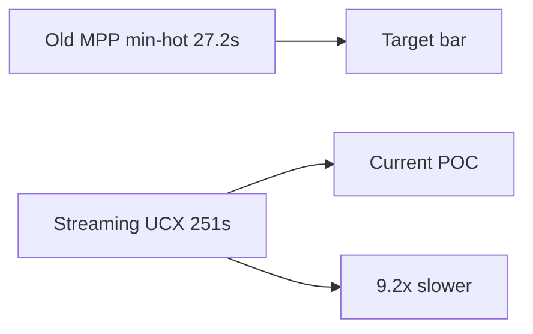
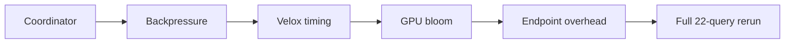

# Spark 4.2 Pipelined UCX Shuffle POC Status - 2026-07-21

## Scope

This document summarizes the current Spark 4.2 / Gluten / Velox POC for fully streaming UCX shuffle on TPC-H 1TB with 4 GPUs.

The public upstream material describes this direction as Spark 4.2 Real-Time Mode (RTM) and related Spark 4.x work. Some local branch and path names still include `spark5` because of the original POC naming, but the design motivation and upstream reference point should be read as Spark 4.2 / Spark 4.x RTM.

The diagrams are intentionally simple so they render cleanly in GitHub Wiki.

The superseded baselines, experiment timeline, rejected A/Bs, and milestone
evidence are preserved in
[Spark Fully-Streaming UCX TPC-H 4GPU History](pipelined-shuffle-tpch-history-20260721-27.md).

## Overall Plan And Success Criteria

The project has two ordered goals.

### Goal 1: Eliminate The Performance Gap

The first goal is to match and then outperform the previous Gluten MPP path
without restoring MPP plan collapse.

The historical reference was the 4GPU Gluten MPP min-hot table:

- Reported 22-query sum: `27.182s`.
- User-facing aggregate target: about `25s`.

That table is retained as a historical performance bar, but it is no longer
classified as a valid SF1000 workload reference. Its Q11 SQL used multiplier
`1e-4`; canonical SF1000 requires `1e-7`. The old Q11 returned zero rows while
the canonical query returns `936,989` rows. Current comparisons therefore
record SQL, result action, result cardinality, fragment-driver count, and
complete-run provenance instead of treating `27.182s` as an exact immutable
baseline.

Performance work is successful only when it also preserves:

- `22/22` query completion.
- Strict fully-GPU execution with no cuDF fallback.
- The Spark-visible stage and shuffle model.
- The native Velox UCX data path.
- Correct failure, cleanup, and bounded-query completion.

The primary performance program is:

1. Attribute the remaining gap using Spark SQL metrics, stage input/shuffle
   metrics, native operator time, blocked time, queue time, endpoint time, and
   GPU occupancy.
2. Remove double admission between Spark task caps, Gluten writer/frontier
   caps, and UCX queue backpressure.
3. Reduce endpoint, polling, RPC, task-launch, and stage-transition overhead.
4. Recover MPP-class operator and exchange efficiency without hiding the query
   behind `MppNativeQueryExec`.
5. Validate every accepted optimization with a complete strict 22-query run
   and per-query comparison against a frozen canonical SF1000 MPP run using
   the same result action.

The performance gate is:

- First milestone: stable complete strict 22-query time at or below a
  reproducible canonical-SF1000, action-matched Gluten MPP run.
- Final milestone: stable complete strict 22-query time below that MPP
  baseline, with no material per-query regression hidden by the aggregate.

#### Goal 1 Live Status - 2026-07-27

The first correctness-valid Spark-visible result has now crossed the previous
Gluten-MPP performance bar:

`phase1-full22-q15-correct-cudf-window-v12-repeat-gpu4567-20260727-0055`

- Complete `22/22`; hot-min sum `25.382s`; timed-median sum `26.625s`.
- cuDF fallback `0`, MPP/BSP plan-collapse evidence `0`, fetch/file errors `0`.
- JVM materialization recorded the expected result cardinality for all 22
  queries on the warmup and all three timed iterations (`88/88` observations).
- It is `1.045s` faster by hot-min and `0.502s` faster by median than the
  previous canonical-SQL/action-matched MPP performance bar
  (`26.427s` hot, `27.127s` median).

The repeated first-milestone gate is now closed by a second uncontended,
identical-plan run:

`phase1-full22-q15-correct-cudf-window-v14-uncontended-confirm-gpu4567-20260727-0101`

- Complete `22/22`; all `88/88` result-cardinality observations match.
- Hot-min sum `25.760s`; timed-median sum `27.124s`.
- cuDF fallback, MPP/BSP collapse, and fetch/file errors are all zero.
- It beats the MPP performance bar by `0.667s` hot and `3ms` median.
- Its artifact/config match v12, and all 22 physical plans have identical
  normalized hashes.

The immediately preceding identical-plan v11 run was `26.458s`, only `31ms`
above the MPP hot bar. v13 then overlapped another user's full cuDF build:
about `175` concurrent `cc1plus`/`nvcc` processes raised host load to `84` and
produced `31.549s`. That run still passed all correctness and strict GPU gates,
but is excluded from performance reproducibility. Before v14, the guard
observed zero external compiler processes, 1-minute load falling from `6.96`
to `5.18` across three samples, and idle GPUs 4--7.

The stricter final criterion of removing every material per-query delta is
still separate from this aggregate first milestone. In v14, Q10 was
`+0.429s` hot and `+0.635s` median versus MPP, while v12 had the same normalized
plan at only `+0.030s` hot. Event metrics attribute the slow v14 iterations to
several Spark stages lengthening together; scan, join, exchange, and aggregate
native operator timings remain broadly stable. A clean 10-iteration matrix
tested shuffle `4/8/16`, scan cap `4/8`, native drivers `1/2`, partial-groupby
bypass, per-executor caps `2/3/4/5`, and native versus driver broadcast. Every
case was strict and cardinality-correct. The best hot was `1.456s` with
shuffle 8/cap 3 versus MPP `1.350s`; no configuration removed the median tail.
Q10 retains six exchange boundaries and seven Spark pipeline groups, whereas
MPP runs the graph as long-lived native fragments. This is a measured
Spark-visible lifecycle gap, not evidence of a regressed Velox-cuDF kernel.

The comparison audit also found that the `26.427s` MPP run is not itself
result-stable on Q15. Its four materializations returned `[0, 1, 0, 1]` rows.
Spark runs with the original plan showed the same nondeterminism. Q15's CTE is
inlined twice, producing two independent lineitem grouped
`sum(double)` reductions; exact comparison of the two separately reduced
floating-point values intermittently misses the maximum. This is a common
Velox-cuDF/plan-lineage issue, not a Spark UCX-only failure. The MPP number is
retained as the requested performance bar, but no longer described as a
correctness-valid full-query reference.

The Q15 fix has two layers:

1. `ReuseGroupedAggregateForScalarMax` rewrites the narrow
   `grouped sum = scalar max(duplicate grouped sum)` shape to one grouped
   aggregate followed by a full-partition max. It removes one fact scan and
   preserves exact equality and tied maxima.
2. Velox `CudfWindow` now executes full-partition `max(field)` on GPU. Before
   this change the Spark physical plan still displayed
   `CudfWindowExecTransformer`, but native validation logged
   `WindowAdapter ... returned false` and ran that operator on Velox CPU.
   This demonstrates why outer Spark plan names alone are insufficient for
   strict GPU validation.

With both layers, Q15 produced one row on every one of 18 materializations
across the isolated stress and three full runs, with native cuDF fallback
zero. Its hot time is `1.079--1.167s`, versus `1.748s` in the MPP performance
run and `1.935s` for the deterministic but CPU-window intermediate.

The current direct architecture/config boundary is:

| Dimension | Gluten-MPP performance run | Spark-visible current |
| --- | --- | --- |
| Outer plan | `VeloxColumnarToRow -> MppNativeQuery -> MppPreparedChild` | scans, exchanges, joins, aggregates and sort remain Spark-visible |
| Execution graph | four long-lived native fragment replicas | 5--10 Spark stages; Velox task and logical UCX state per task/edge |
| Shuffle width | `16`; local hash width `4` | default `8`; query-scoped `4` or `16` where measured |
| Native drivers | `2` per fragment | `1` per Spark task |
| File planning | 8GiB ceiling, minimum 60 splits | 16GiB ceiling, minimum 4; selected fact scans capped at 8 tasks |
| GPU memory/concurrency | pool 55%, concurrent GPU tasks 2 | arena 55%, concurrent GPU tasks 2, hash-build admission 1 |
| Replicated fanout | four GPU replicas | consumer-task fanout, native intra-node broadcast enabled |
| Scheduler admission | prestarted fragment graph | producer cap 10, global per-executor cap 5; Q2/Q6/Q22 use 6 and Q3/Q11 use 4 |
| Result validation | Q15 alternates 0/1 rows | expected per-query cardinality required for every warmup/timed materialization |

##### Historical 2026-07-26 Status (Superseded)

The section below preserves the investigation sequence and older performance
snapshots for auditability. Its `27.721s` "best" and remaining-gap statements
are superseded by the 2026-07-27 live status above.

The best complete strict Spark-visible run is now:

`phase1-full22-exclusive2-filteredq21-defaultscan-scan8-q3q8q10q19-pool-rawkey-intranodetrue-cap1-q14default-p10-e6-s8-d1-gpu4567-20260726`

- Complete `22/22`, cuDF fallback `0`, MPP plan-collapse evidence `0`.
- Hot-min sum `27.721s`; timed-median sum `29.320s`.
- GPU process sampling throughout the run showed only this run's Spark
  executors on physical GPUs 4--7; externally contended runs remain excluded.
- The per-query hot-min envelope across three valid complete runs is
  `26.775s`. Replacing Q21 with its isolated 10-iteration filtered-join-cache
  result gives `26.728s`; this is diagnostic evidence, not a complete-run score.

The latest architecture A/Bs narrow the remaining gap further:

- Normalizing generated `plan_id` and scalar-subquery identifiers, all 22
  physical-plan shapes and operator multisets are identical between the
  `27.721s` best run and the latest query-scoped-Q1 full run. The latter
  completed strict `22/22` at `28.877s` hot and `30.054s` median, so its
  non-Q1 regression is runtime variance/contamination under the same plan, not
  a join, scan, exchange, or aggregation-plan regression.
- Q11 `spark.sql.exchange.reuse=false/true` produced the same physical shape
  (`ReusedExchange=0`, four replicated exchanges), the same `208/208` UCX
  writer/reader logical-endpoint count, and statistically identical
  `1.027/1.024s` hot times. This is intentional: while pipelined shuffle is
  enabled, Spark's local `ReuseExchangeAndSubquery` safety patch preserves
  every exchange edge because a native UCX destination queue has destructive
  reads and cannot replay one sequence space to two consumers.
- Disabling native streaming broadcast reduced Q11 endpoints to `128/80`, but
  regressed hot time to `2.364s`; it is rejected. MPP's advantage is its
  long-lived native multi-consumer fragment graph, not driver broadcast.
- A real startup-level replicated hash-cache A/B on Q8/Q10/Q21 regressed hot
  sum from `5.662s` to `6.219s` (`+9.8%`) and per-query median sum from
  `6.239s` to `7.081s` (`+13.5%`). Caching at `CudfHashJoin` is too late to
  remove each consumer's UCX logical source, stream, and task.
- Query-scoped partial-groupby admission was neutral and is rejected. A new
  native-runtime-scoped GPU semaphore is frozen in
  `spark5-query-scoped-gpulock-504869beb-20260726-1507`. On the target 4GPU
  topology, lock-off completed 9/10 and failed once with a TableScan
  `cudaErrorIllegalAddress`; lock-on completed 10/10 strict at `1.849s` hot
  and `1.9055s` median. A query-local producer-cap verification completed 5/5
  at `1.868s` hot. The corresponding strict full run improved Q1 from
  `2.041s` to `1.928s` but regressed the aggregate to `28.877s`, so it is not
  the new best.
- Velox's `Communicator` already caches outgoing physical UCXX endpoints by
  remote `HostPort` inside each executor process. Native diagnostics observed
  `982` logical sources, `966` endpoint-cache hits, and only `16` creates
  (`98.37%` reuse); a second application observed `1364/1348/16`
  (`98.83%`). These are source-side outgoing creates, not the total incoming
  plus outgoing physical-endpoint count. Therefore the remaining architecture
  cost is per-edge logical source, AM handshake, queue/stream state, and
  Velox-task lifecycle, not one outgoing connection per Spark task. Ready
  peers normally respond in tens to hundreds of microseconds. Second-scale
  tails are a control-plane/progress/endpoint-wire-up tail when the remote task
  graph is not ready; the acceptor responds once the AM callback is serviced
  and does not wait for producer-task registration.
- A source-level old/new Velox comparison found a real progress regression.
  The old MPP communicator always used non-blocking
  `progressWorkerEvent(0)`; the current path used an indefinite `-1` wait when
  its work queue was empty. Restoring the old behavior reduced clean
  Q1/Q8/Q21 hot sum from `8.629s` to `6.385s` and median sum from `10.313s`
  to `6.542s`.
- The corresponding full candidate completed Q1--Q20 at `24.095s` hot versus
  `24.818s` for the current best and `23.657s` for MPP on the same 20 queries.
  It then failed in Q21 warmup with a first
  `CudfHashJoinProbe`/lineitem-filter `cudaErrorIllegalAddress`; the UCX
  progress thread subsequently observed the same sticky CUDA error and
  aborted the executor. The run is invalid, but its first-20 result preserves
  the progress optimization as the next candidate.
- The stable MPP artifact allocated remote UCX receive buffers with a
  dedicated synchronous `cuda_memory_resource`; the current path uses the
  shared stream-ordered RMM pool. A default-off compatibility switch,
  `GLUTEN_UCX_RECV_USE_DEDICATED_CUDA_MR=true`, is frozen in artifact
  `spark5-ucx-mpp-dedicated-recv-mr` for Q21 stability and full-22 A/B. Its
  `libgluten.so` SHA256 is
  `ca5ca9bb9dfe2df85905b84d6071fb9acf76834f795ed4fa3340cc112d848349`.
- Q21 confirms why the collapsed outer MPP plan cannot be read as “one
  fragment, zero exchanges.” Its runtime planner logs show at least fragment
  `F7`, remove four local sorts, push one replicated broadcast join into the
  hash-exchange producer, insert partial TopN after final aggregation, raise
  the post-join final-aggregate fragment from two to four drivers, and use
  size-aware roughly `3.34--3.93GiB` lineitem file partitions. The
  Spark-visible Q21 keeps eight Spark stages, seven native UCX shuffle edges,
  and consumer-task-granularity fanout. These are concrete planner and
  execution-unit differences despite both paths using Velox-cuDF operators.

The clean endpoint/progress A/Bs above completed before external GPU
contention began. A later Q21 stress run overlapped `presto_server` processes
that started on physical GPUs 4--7 at 15:59:56 and is excluded from both
performance and stability comparisons.

A second clean complete confirmation,
`phase1-full22-confirm5-canonical-exclusive-pool-rawkey-intranodetrue-cap1-p10-e6-s8-d1-gpu4567-20260726`,
completed `22/22` with hot-min `28.426s`, timed median `29.817s`, cuDF
fallback `0`, and MPP collapse `0`. Q13 completed its warmup and all three
timed iterations; the earlier isolated `cudaErrorIllegalAddress` was not
reproduced. Both complete runs used the frozen query-bundle hash
`b308cd3d73462c8ea37d18b787159b57e3d504675f1811d9b848b64340ff198c`
and canonical Q11 multiplier `1e-7`.

#### MPP baseline correction and controlled A/B

The old MPP run profile defaults to a legacy `q11-standard` query bundle,
whose Q11 multiplier is `1e-4`. The canonical SF1000 query bundle uses
`1e-7`. Controlled runs with the same `f9fe54e8c` MPP artifact, four physical
GPUs, pool MR 55%, shuffle 16, local hash width 4, and two fragment drivers
show:

| MPP Q11 lane | Result action | Output rows | Hot | Median |
| --- | --- | ---: | ---: | ---: |
| historical threshold `1e-4` | Python `collect` | `0` | `0.493s` | `0.5365s` |
| canonical SF1000 `1e-7` | Python `collect` | `936,989` | `1.858s` | `1.938s` |
| canonical SF1000 `1e-7` | JVM `collectAsList`, drivers 2 | `936,989` | `0.765s` | `0.8425s` |
| canonical SF1000 `1e-7` | JVM `collectAsList`, drivers 1 | `936,989` | `0.718s` | `0.7995s` |

The outer physical plan is byte-for-byte identical in the two SQL-threshold
runs:
`VeloxColumnarToRow -> MppNativeQuery -> MppPreparedChild Sort`.
Native metrics in the canonical run expose the hidden
`TableScan/UcxExchange/CudfHashJoinBuild/CudfHashJoinProbe/CudfAggregation`
fragment graph and confirm `936,989` final rows on every iteration. The
historical-threshold run confirms zero final rows on every iteration. This is a
workload/result-cardinality error, not evidence that the current Q11 operator
graph regressed by the previously reported `0.463s`.

The timing action matters independently. For canonical Q11, the MPP
DAGScheduler `collect` job hot time is about `0.442s`, while Python result
conversion raises end-to-end hot time to `1.858s`; JVM `collectAsList` gives
`0.718--0.765s`. Current Spark-visible Q11 is `0.899s` end to end and
`0.841s` in the Spark SQL execution event. Thus:

- MPP still has about `0.40s` lower engine-side Q11 execution time because its
  scalar branch and main branch stay in one long-lived fragment graph.
- Current Spark avoids Python conversion, so comparing its `0.899s` directly
  with MPP Python `1.858s` would incorrectly claim an operator win.
- Replacing historical Q11 `0.436s` with the canonical, JVM-action,
  one-driver hot result `0.718s` gives a provisional corrected legacy bar of
  `27.464s`; the best complete Spark-visible run is still `0.257s` above that
  conservative mixed-source estimate.

A clean, complete canonical JVM-action MPP run with one driver per fragment
was also reproduced:
`mpp-reference-full22-sf1000-jvmcollect-drivers1-f9fe54e8c-drivergpu0-gpu4567-20260726-1245`.
It completed 22/22 with hot-min `34.092s`; current Spark-visible is `6.371s`
faster. This proves that the recorded `27.182s + drivers=1` combination is not
reproducible as one frozen run. The formal 2026-06-25 fast-MPP report instead
records drivers 2 and `25.856s`, but used the wrong Q11 SQL and did not rerun
correctness.

A clean, complete canonical JVM-action MPP run with two drivers per fragment
has now also been reproduced:
`mpp-reference-full22-sf1000-jvmcollect-drivers2-f9fe54e8c-exclusive-gpu4567-20260726-1303`.

- Complete `22/22`; hot-min `26.427s`; timed-median `27.127s`.
- Same `f9fe54e8c` artifact, canonical query-bundle SQL, JVM
  `collectAsList`, shuffle 16, local-hash width 4, pool MR 55%,
  `concurrentGpuTasks=2`, and two fragment drivers.
- GPU process sampling throughout the run showed only its four Java executors
  on physical GPUs 4--7.

This `26.427s` run is the current reproducible performance gate. The best
complete Spark-visible run is `1.294s` slower. The historical `27.182s` table
and the provisional mixed-source `27.464s` estimate remain useful audit
records, but neither replaces this frozen, SQL/action/config-matched run.

The plan/config comparison now separates three MPP evidence sources:

- The historical `27.182s` per-query target table records
  `maxDriversPerFragment=1`, but its event/native-operator artifact has not
  been located and its Q11 was not canonical SF1000.
- The reproducible old-MPP diagnostic run
  `mpp-reference-q3q9q10q18-f9fe54e8c-runtime-fixed-gpu4567-20260725-054333`
  exposes native fragment metrics and uses 2 fragment drivers, local hash
  exchange width 4, shuffle partitions 16, pool MR, and
  `concurrentGpuTasks=2`. It is used for architecture/operator attribution,
  not as a fabricated operator trace for the `27.182s` table.
- The new canonical JVM-action full run above supplies complete 22Q
  reproducibility for drivers 1.
- The matching drivers-2 full run supplies the current `26.427s` gate and the
  direct per-query comparison used below.

The important shape difference remains the execution unit. MPP shows one
outer `MppNativeQuery` and runs a long-lived native fragment graph on four GPU
replicas. The Spark-visible path exposes 5--10 Spark stages per query and
creates one Velox task plus logical UCX source/server/stream state per Spark
shuffle edge. Physical endpoints are process-wide and peer-cached, but the
logical state and handshake remain task-scoped. Consequently, replicated input
fanout follows consumer-task count (4/5/8/12) rather than always four GPU
replicas, and MPP fragment drivers are not equivalent to Spark native drivers
per task. Direct A/B confirms that increasing the latter from 1 to 2 regresses
the current path.

The accepted Spark-visible tuning is currently shuffle partitions 8, one
native driver per Spark task, pool MR, `concurrentGpuTasks=2`, raw-key native
Murmur3 partitioning, intra-node exchange enabled, producer cap 10,
per-executor cap 6, and hash-build admission 1. Q3/Q8/Q10/Q19 use a scan-task
ceiling of 8; Q21 keeps the default scan geometry and enables the recovered
filtered-join cache.

Against the complete canonical drivers-2 MPP run, the best Spark-visible run
is slower on 14 queries and faster on 8. The largest positive deltas are Q1
`+0.367s`, Q21 `+0.285s`, Q8 `+0.268s`, Q11 `+0.246s`, Q13 `+0.246s`, and
Q10 `+0.207s`. Spark-visible is already faster on Q18 `-0.161s`, Q22
`-0.152s`, Q14 `-0.139s`, Q7 `-0.132s`, Q17 `-0.128s`, Q9 `-0.074s`, Q20
`-0.066s`, and Q16 `-0.024s`. This mixed result rules out a universal
Velox-cuDF operator regression. Q1 and Q12 each launch 12 lineitem scan tasks,
while Q13 launches a five-task orders producer followed by eight downstream
tasks. These remain lifecycle and fanout differences from the four-replica,
long-lived MPP fragment graph.

Q1 now supplies the smallest high-confidence path across the provisional
`27.464s` bar. With the ordinary producer cap 10, its 12 scan tasks run as an
uneven `3/3/2/2` wave and Q1 hot is `1.85--2.04s`. Allowing all 12 pure
producer tasks reduces isolated hot time to `1.41s`, but repeated
simple-producer-cap 11/12 tests each suffered one native failure:
`CudfGroupbyPARTIAL cudaErrorIllegalAddress` or a UCX metadata cancellation
after an executor abort. Old MPP keeps only one or two long-lived fragment
drivers per GPU; Spark can expose three independent Velox tasks per GPU in
this shape.

A global two-operation `GpuLock` made simple-producer cap 12 stable for Q1
(`10/10`, hot `1.808s`), but the corresponding strict 22Q run regressed from
`27.721s` to `28.095s`. It improved Q1, Q8, and Q6 while slowing Q18, Q20,
Q21, Q15, and others, so the global guard is rejected.

The replacement is a query-scoped
`spark.gluten.sql.columnar.backend.velox.cudf.partialGroupby.maxConcurrent`
guard. It synchronizes and admits only partial cuDF groupby calls; scan,
shuffle, join, and final aggregation remain unlocked. The new artifact passed
a stronger three-GPU functional stress run with 12 producer tasks:
`phase1-q1-simpleproducer12-partialgroupby2-functional-p10-e6-s8-d1-i10-gpu013-20260726-1332`.
It completed Q1 `10/10`, strict cuDF, with zero fallback, CUDA, fetch, or
executor errors. Its `2.081s` hot time is not a performance result because it
uses three GPUs. A clean four-GPU Q1 and full-22Q measurement remains required;
physical GPUs 4--7 are currently occupied by another user's Presto run and no
contended measurement will be accepted.

The Velox-cuDF lineage audit found one confirmed missing performance change:
old MPP commit `becec9ebf` cached `cudf::filtered_join` across semi/anti probe
batches, but it is not an ancestor of the current Velox branch. Restoring it
behind a query config made Q21 complete 10/10 with hot `2.377s` and median
`2.5225s`; the fresh cache-off control exhausted GPU memory during warmup.
Other suspected old-branch changes checked so far (deferred join-filter setup,
cross-stream concat/free ordering, receive-byte admission, and the RMM current
resource API) have equivalents in the current refactored code and are not
classified as regressions.

Two later complete/partial runs are excluded from performance conclusions:
another root-owned Presto benchmark started on physical GPUs 4--7 after
preflight. One Spark run completed under contention (`31.799s`) and another
was stopped after Q2. Exclusive-GPU validation must be repeated after that job
releases the devices.

### Goal 2: Converge With Upstream Spark RTM

Each performance iteration should also move the implementation closer to
upstream Spark's RTM execution model. The target is not a permanently separate
batch scheduler fork. The target is to reuse the upstream pipelined execution
primitives for bounded batch queries.

In this document, "RTM for batch" means:

- A bounded Spark SQL query uses RTM's pipelined shuffle dependency and
  concurrent-stage execution model.
- Producer and consumer stages run concurrently over an incrementally readable
  shuffle.
- Spark owns generic group admission, co-residency, completion, and failure.
- Gluten/Velox supplies the GPU-aware UCX data plane and dynamic device flow
  control.
- Batch completion remains finite and deterministic; it does not require a
  Structured Streaming source or `Trigger.RealTime`.

The upstream-convergence program is:

1. Track upstream `PipelinedShuffleDependency`, incremental shuffle routing,
   and native `DAGScheduler` concurrent-group work.
2. Replace local Spark mechanisms as equivalent upstream implementations
   become available.
3. Keep upstream-neutral extension points for batch-specific throughput tuning.
4. Move GPU memory, UCX queue, endpoint, and native-drain policy out of generic
   Spark scheduler code and into Gluten/Velox.
5. Continuously measure the remaining local Spark production diff and delete
   duplicated scheduler/control-plane code.
6. Validate both Structured Streaming RTM semantics and bounded batch
   semantics against the same underlying pipelined execution contracts.

The architecture gate is:

- The same upstream-aligned pipelined dependency and concurrent-group model can
  execute RTM and bounded batch workloads.
- Local Spark changes contain only missing upstream hooks or justified
  batch-throughput policy.
- Query-wide GPU/UCX logic is isolated behind Gluten interfaces rather than
  embedded in generic Spark scheduling.
- The fully-GPU 22-query performance gate remains green while local Spark code
  is removed.

The goals are ordered but not independent. Performance remains the first
release gate, while upstream convergence is a constraint on how each
optimization is implemented.

## Code Branches

| Component | Branch |
| --- | --- |
| Spark | `poc/tpch4gpu-spark5-20260717` |
| Gluten | `poc/tpch4gpu-gluten-20260717` |
| Velox | `poc/tpch4gpu-velox-20260717` |

## Motivation

The old Gluten MPP path is very fast, but it relies on collapsing Spark query fragments into native MPP execution. That gives most query control to the native MPP layer instead of Spark's normal shuffle, stage, task, retry, and resource model. It is the current performance target, but it is not an incremental Spark shuffle manager.

The target of this POC is different:

- Keep Spark stages and shuffle dependencies visible to Spark.
- Push shuffle data to downstream tasks as soon as batches are ready.
- Run producer and consumer stages concurrently.
- Use Velox UCX exchange as the native GPU data plane.
- Avoid MPP plan collapse.
- Avoid CPU fallback.
- Add enough query/group-level control to avoid deadlock, memory blow-up, and unnecessary spill.

## Upstream Spark Changes

Relevant upstream references:

- Databricks Spark 4.2 blog: https://www.databricks.com/blog/introducing-apache-spark-42
- Apache JIRA SPARK-54699: https://issues.apache.org/jira/browse/SPARK-54699
- Apache Spark 4.1 release notes: https://spark.apache.org/releases/spark-release-4.1.0.html
- Databricks RTM introduction: https://www.databricks.com/blog/introducing-real-time-mode-apache-sparktm-structured-streaming

The important upstream points for this POC are:

- Streaming shuffle is push-based: upstream tasks can send output directly to downstream tasks.
- Concurrent stage scheduling is required: dependent stages must be allowed to run at the same time.
- Upstream RTM starts from Structured Streaming. It does not directly provide a batch SQL MPP query coordinator.

## Spark 4.2 POC Changes

The Spark-side POC changes turn the RTM direction into a batch SQL incremental shuffle path:

- Add pipelined shuffle dependency metadata for supported columnar exchanges.
- Route pipelined shuffles through `UcxColumnarShuffleManager`.
- Keep normal shuffles on the existing columnar shuffle manager.
- Allow concurrent pipelined task sets in `TaskSchedulerImpl`.
- Track live task sets so resident readers remain visible even when they have no pending tasks.
- Gate producer refill on downstream reader residency.
- Add scheduler tests for the updated `TaskSchedulerImpl` behavior.

These changes need to live in Spark because they affect stage admission, task-set liveness, resource fairness, and shuffle manager routing. Gluten and Velox cannot fully solve those from below Spark.

## Current Architecture

The native UCX template no longer uses the old Gluten MPP plan-collapse workaround. Spark keeps the stage graph visible, Gluten owns UCX metadata/control, and Velox owns native GPU data movement.

Current path:

1. Spark physical planning marks supported columnar shuffle dependencies as pipelined.
2. `PipelinedShuffleManagerRouter` sends pipelined shuffles to `UcxColumnarShuffleManager`.
3. Gluten creates UCX shuffle handles and registers writer/reader endpoints.
4. `NativeUcxShuffleReadMetadataIterator` exposes reader metadata.
5. `VeloxIteratorApi` passes UCX reader specs and writer context into Velox task construction.
6. `SubstraitToVeloxPlan` creates Velox UCX `ExchangeNode`s.
7. `VeloxRuntime` wraps writer tasks with native UCX `PartitionedOutput`.
8. Velox cuDF adapters replace these with `UcxExchange` and `UcxPartitionedOutput`.

Representative evidence from the latest Q7 validation:

- `spark.gluten.mpp.enabled=false`
- `spark.sql.shuffle.pipelined.enabled=true`
- `spark.shuffle.manager.incremental=org.apache.spark.shuffle.UcxColumnarShuffleManager`
- `dataPlane=velox-native-ucx-exchange`
- `Created Velox UCX ExchangeNode`
- `replacing Exchange with UcxExchange`
- `Wrapped Velox plan with native UCX PartitionedOutput`
- `replacing PartitionedOutput with UcxPartitionedOutput`

## Difference From Old Gluten MPP

| Area | Old Gluten MPP | Streaming UCX POC |
| --- | --- | --- |
| Spark stage visibility | Mostly hidden behind native MPP | Preserved |
| Shuffle model | Native MPP exchange | Spark incremental shuffle manager |
| Data plane | Native Velox/MPP | Velox UCX exchange |
| Query coordinator | Native MPP coordinator | Spark/Gluten driver-side coordinator needed |
| Performance today | Fast baseline | Functional but slow |
| Main value | Maximum fused native execution | Spark-compatible streaming shuffle design |

## Fit With Streaming MPP

What already matches the streaming MPP design:

- Push-based UCX shuffle data path.
- Concurrent producer and consumer stages.
- All-stage-up style reader residency checks.
- Spark-visible shuffle dependency.
- Driver-side group control in Spark/Gluten.
- Velox-native `UcxExchange` and `UcxPartitionedOutput`.
- No `MppNativeQueryExec` path in the native UCX template.

Main gaps:

- Production query/group coordinator is still missing.
- Backpressure needs a stronger cross-layer credit model.
- Failure, retry, endpoint cleanup, and abort semantics are still POC-level.
- Runtime bloom currently has a fully-GPU gap.
- Velox native operator timing is still insufficient for deep performance attribution.
- Performance is not close to the old 4GPU Gluten MPP baseline yet.

## SPIP RTM Overlap And Code Ownership - 2026-07-25

### Conclusion

Most of the generic Spark scheduler work in this POC is now on the upstream RTM
roadmap. The Gluten query coordinator is only partially redundant, however. The
important distinction is what each backpressure mechanism controls.

The original SPIP describes long-lived tasks, concurrent stages, and streaming
shuffle. Later implementation work added connection-level streaming-shuffle
flow control. That flow control does not replace source admission, pipelined
group resource admission, or query-wide GPU/UCX memory control.

### Backpressure Is Not One Mechanism

| Mechanism | Controlled resource | Scope | Expected owner |
| --- | --- | --- | --- |
| Source admission | Source offsets and input rate | Streaming source | Spark `SupportsAdmissionControl` |
| Streaming-shuffle flow control | Per writer/reader credit and receive byte quota | One transport connection | Spark shuffle transport |
| Pipelined group admission | Slots, co-residency, completion, and failure | One pipelined stage group | Spark `DAGScheduler` |
| GPU/UCX query control | Native queued bytes, writer frontier, GPU memory, and drain | All exchanges in one query | Gluten/Velox |

Pipelined group admission is a resource and correctness requirement rather than
another name for transport backpressure. The upstream scheduling discussion
requires all stages in a pipelined group to be co-resident. Once the group is
admitted, transport backpressure can handle temporary downstream unreadiness.

Relevant upstream references:

- `PipelinedShuffleDependency`:
  https://apache.github.io/spark/api/scala/org/apache/spark/PipelinedShuffleDependency.html
- Current RTM work items, including SPARK-58076:
  https://issues.apache.org/jira/issues/?jql=project%20%3D%20SPARK%20AND%20component%20%3D%20%22Structured%20Streaming%22
- Concurrent scheduling design and group semantics:
  https://github.com/apache/spark/pull/56055
- Source admission control:
  https://spark.apache.org/docs/latest/api/scala/org/apache/spark/sql/connector/read/streaming/SupportsAdmissionControl.html
- Streaming-shuffle credit and receive quota implementation:
  https://github.com/apache/spark/blob/master/core/src/main/scala/org/apache/spark/shuffle/streaming/StreamingShuffleClientHandler.scala

### Spark-Side Overlap

`PipelinedShuffleDependency` and incremental shuffle-manager routing have
already landed upstream under SPARK-58078. Native concurrent scheduling in
`DAGScheduler` is tracked by SPARK-58076. The upstream design treats the
pipelined group as the unit of:

- Admission and slot checking.
- Simultaneous stage residency.
- Deferred stage and job completion.
- Group-atomic failure and rerun.

The local Spark production diff from base `7bdb60e68cd` contains approximately
`2,516` added and `65` deleted lines under `core` and `sql`. `DAGScheduler` and
`TaskSchedulerImpl` account for `1,777` added lines, or about `71%` of the
production additions. Including dependency markers, manager routing, group
lifecycle, and task-set failure behavior, approximately `85-90%` of the Spark
fork is conceptually on the upstream RTM path.

This code cannot all be removed immediately because SPARK-58076 is still in
progress. The intended migration order is:

1. Replace the local dependency marker and shuffle-manager routing with the
   upstream implementation.
2. Keep the local concurrent scheduling behavior only as a temporary gap.
3. Delegate group discovery, slot admission, completion, and failure to Spark
   after SPARK-58076 is available and validated for bounded batch queries.
4. Retain only batch-throughput tuning hooks that are not provided by RTM.

### Gluten/UCX Responsibilities That Remain

The upstream Netty streaming shuffle does not understand the native GPU/UCX
data plane. Gluten still needs to own:

- UCX reader and writer endpoint registration.
- Spark attempt to native-task identity and cleanup.
- Native queue telemetry and error propagation.
- Query-wide `maxQueuedBytes` / `resumeQueuedBytes` hysteresis.
- Active-writer fairness and shuffle-depth/frontier progress.
- Downstream-drain safety and native writer `noMoreData`.
- GPU memory pressure, broadcast/scalar exchange behavior, and native metrics.

At the current POC snapshot,
`UcxShuffleCoordinator.scala` and `UcxColumnarShuffleManager.scala` contain
about `3,938` lines. The query-level control change added about `2,338` lines to
these two files. After upstream scheduling integration, a conservative first
cleanup target is `800-1,200` production lines of duplicated group lifecycle,
admission, readiness, and RPC plumbing. Removing the full `2,338` lines would
also remove required UCX/GPU behavior.

### Target Ownership Boundary

Spark should own static feasibility and correctness:

- Pipelined group construction.
- Co-residency and slot admission.
- Stage and job completion.
- Group-atomic failure semantics.

Gluten/UCX should own dynamic device and transport flow:

- Native endpoint lifecycle.
- Receiver-driven credit or byte flow.
- GPU memory and queued-byte watermarks.
- Downstream drain and native completion/error telemetry.

Only one layer should be authoritative for each decision. Spark and Gluten
should not independently apply static admission caps to the same writer
population.

### Performance Implication

The current path can apply three throttles simultaneously:

1. Spark stage/task concurrency caps.
2. Coordinator active-writer/frontier caps.
3. UCX queued-byte backpressure.

These controls can leave GPUs or task slots idle even when each individual
safeguard is working correctly. This is a plausible source of the remaining
gap to the `27.182s` Gluten MPP reference.

The next controlled experiment should preserve native
`maxQueuedBytes` / `resumeQueuedBytes` and downstream-drain correctness while
raising the query `maxActiveWriters` limit high enough that it no longer acts
as a second static admission gate. Compare:

- Complete 22-query elapsed time.
- `ucxWriterCreditWait`.
- Native queued bytes and blocked writers.
- GPU occupancy.
- Per-operator execution and blocked time.

An improvement would identify double admission, rather than operator compute,
as the primary remaining bottleneck.

## Control Plane And Backpressure

The current POC has three internal control layers. These describe the current
implementation; the target ownership boundary above moves generic group
admission and failure semantics to upstream Spark.

| Layer | Responsibility |
| --- | --- |
| Spark driver scheduler | Pipelined groups, concurrent stages, task-set liveness, reader residency, producer refill |
| Gluten UCX coordinator | Shuffle/group state, endpoint registration, readiness, completion, abort |
| Velox UCX exchange | Native queues, GPU buffers, local operator blocking and data movement |

Velox can block local operators when UCX queues are full. That is necessary but not sufficient. Spark/Gluten still need global state: which stages are admitted, which readers are resident, whether producers may refill, whether a group should abort, and how retry/cleanup should happen.

The latest Spark scheduler fix keeps live task sets in a pipelined group registry instead of relying only on `Pool.getSortedTaskSetQueue`. This matters because a downstream reader task set can have zero pending tasks while its already-launched tasks are still resident. Without the live registry, Spark can lose visibility of live readers and block producer refill with `waiting-for-reader-residency`.

## Current Validation

Latest focused validation after the live task-set registry fix:

| Run | GPUs | Runtime bloom | Time | Functional | Strict GPU | MPP evidence | Velox UCX evidence |
| --- | --- | --- | ---: | --- | --- | ---: | --- |
| Q7 | `0,1,6,7` | enabled | `17.227s` | pass | no, `122` cuDF fallbacks | `0` | `29` exchanges, `253` outputs |
| Q7 | `0,1,3,4` | disabled | `32.801s` | pass | pass, `0` cuDF fallbacks | `0` | `28` exchanges, `252` outputs |

Run roots:

- Bloom enabled Q7: `/raid/ferdinandx/gtc/poc/spark5-pipelined-tpch4gpu-20260717/tpch-4gpu-gpu03/runs/native-velox-plan-q7-4gpu0167-livegroup-20260721-094942`
- Bloom disabled Q7: `/raid/ferdinandx/gtc/poc/spark5-pipelined-tpch4gpu-20260717/tpch-4gpu-gpu03/runs/native-velox-q7-4gpu0134-querybloomoff-20260721-095737`

Spark scheduler unit validation:

- `org.apache.spark.scheduler.TaskSchedulerImplSuite`
- Result: `123` tests passed

## Historical 22-Query Streaming UCX Result

The best completed 22-query 4GPU strict run from the current streaming UCX POC profile is:

- Run root: `/raid/ferdinandx/gtc/poc/spark5-pipelined-tpch4gpu-20260717/runs/full22-queryconf-q14-cap12-20260720-0640`
- Complete: true
- Functional complete: true
- Strict cuDF complete: true
- Sum of query times: `250.436s`
- Power test time: `251.000s`
- Total wall time including table setup: `263.295s`
- MPP evidence: `0`
- cuDF fallback: `0`
- UCX writer endpoints: `3156`
- UCX reader endpoints: `8161`
- Native UCX shuffle handles: `3437`

Important caveat: this 22-query run was before the latest Spark live task-set registry fix. The latest code has not yet been rerun for a full 22/22 pass.

## Previous Gluten MPP 4GPU Baseline

The previous fast 4GPU result was from the old Spark 3.5 + Gluten MPP collapsed/native execution path:

- Spark: `spark-3.5.5-bin-hadoop3`
- `spark.gluten.mpp.enabled=true`
- 4 executors, 1 GPU per task, `spark.task.resource.gpu.amount=1`
- `spark.sql.shuffle.partitions=16`
- Runtime bloom enabled
- `mpp.maxDriversPerFragment=1`
- `cudf.concurrentGpuTasks=2`
- Current reference baseline: `4GPU Gluten MPP min-hot`
- Sum of query times: `27.182s`
- User-facing aggregate target: about `25s` on 4 GPUs

This is the current usable per-query reference for comparison against the streaming shuffle POC. There may be a faster min-hot run, but this table is internally consistent and should be used instead of the invalid `0.xs` failed-run data.

The source note for this baseline also compared against 4GPU PrestoDB: MPP sum `27.182s`, PrestoDB sum `29.376s`, and Presto/MPP `1.08x`. The rest of this document uses only the Gluten MPP min-hot column to compare against the streaming shuffle POC.

Important correction: the previously cited local run root must not be used for old-MPP per-query comparison:

- Invalid per-query source: `/raid/ferdinandx/q2/runs/perf-4gpu-20260603/single-session-agent2-q17fix-full22-20260612-093223`
- Its `time.csv` reports `Power Test Time=23.000s`, but the 22 `queryN` rows sum to only `4.685s`.
- All 22 JSON summaries in that run report `queryStatus=["Failed","Failed","Failed"]`.
- The failure reason is executor placement for `MppNativeQueryRDD`, for example `partition 0 expected executor 0, but Spark scheduled it on 4`.

Therefore, do not use the `0.xs` per-query numbers from the invalid run. Use the `4GPU Gluten MPP min-hot` values above unless a faster valid min-hot artifact is located.

This baseline is not apples-to-apples with the streaming UCX POC. It used old Gluten MPP execution, which fused native query fragments and bypassed much of Spark's normal stage-by-stage execution overhead. It remains the target performance bar, but it is not an incremental Spark shuffle manager.

## Performance Comparison

At 22-query level:

| Metric | Streaming UCX POC | Old Gluten MPP baseline | Gap |
| --- | ---: | ---: | ---: |
| Power test time | `251.000s` | about `25s` target | about `10x` slower |
| Sum of query times | `250.436s` | `27.182s` min-hot | `9.2x` slower |
| Total wall time | `263.295s` | valid comparable source not yet located | not computed |
| cuDF fallback | `0` in strict 22/22 run | not recomputed from min-hot table | unknown |
| MPP plan-collapse evidence | `0` | MPP enabled / collapsed path | intentionally different |

Per-query comparison against the `4GPU Gluten MPP min-hot` reference:

| Query | Streaming UCX POC s | Gluten MPP min-hot s | Gap |
| --- | ---: | ---: | ---: |
| Q1 | 5.512 | 1.782 | 3.1x |
| Q2 | 6.583 | 0.757 | 8.7x |
| Q3 | 14.404 | 1.236 | 11.7x |
| Q4 | 2.852 | 0.712 | 4.0x |
| Q5 | 31.957 | 1.278 | 25.0x |
| Q6 | 0.852 | 0.798 | 1.1x |
| Q7 | 19.572 | 1.521 | 12.9x |
| Q8 | 13.300 | 1.541 | 8.6x |
| Q9 | 12.540 | 1.657 | 7.6x |
| Q10 | 19.502 | 1.333 | 14.6x |
| Q11 | 4.763 | 0.436 | 10.9x |
| Q12 | 15.425 | 0.891 | 17.3x |
| Q13 | 4.625 | 1.181 | 3.9x |
| Q14 | 2.892 | 1.098 | 2.6x |
| Q15 | 6.210 | 1.832 | 3.4x |
| Q16 | 5.310 | 0.447 | 11.9x |
| Q17 | 18.440 | 1.607 | 11.5x |
| Q18 | 28.332 | 1.532 | 18.5x |
| Q19 | 2.819 | 1.193 | 2.4x |
| Q20 | 6.067 | 1.486 | 4.1x |
| Q21 | 25.667 | 2.267 | 11.3x |
| Q22 | 2.812 | 0.597 | 4.7x |
| SUM | 250.436 | 27.182 | 9.2x |

The previous `0.xs` MPP numbers came from a failed run and were removed.

## Performance Interpretation

The current POC has passed the important functional checks: 22/22 queries completed in a strict fully-GPU streaming UCX run, MPP evidence was zero, cuDF fallback was zero, and Velox native UCX exchange/partitioned output evidence was present.

The performance is still far from acceptable. The largest likely contributors are:

- Spark task/stage overhead is visible again because the query is no longer hidden by MPP plan collapse.
- The current control plane is conservative and can underfill GPUs.
- Endpoint/control metadata overhead is high: thousands of writer endpoints, reader endpoints, and shuffle handles.
- Runtime bloom has a speed/correctness trade-off today: bloom enabled is faster on Q7 but not strict fully GPU; bloom disabled is strict fully GPU but slower.
- We need Velox native plan operator timing, not `MppNativeQuery` timing, to split shuffle wait, compute time, queue blocking, endpoint setup, and scheduler gaps.

## Next Work

Next engineering targets:

1. Finish the driver-side pipelined query/group coordinator state machine.
2. Tighten Spark/Gluten/Velox backpressure with a real credit signal.
3. Add Velox native operator timing for `UcxExchange`, `UcxPartitionedOutput`, GPU compute, blocked time, queue wait, endpoint wait, and spill/fallback counters.
4. Fix or replace the runtime bloom path so it remains fully GPU.
5. Reduce endpoint setup and polling overhead.
6. Rerun full 22/22 after the next coordinator/backpressure iteration.
